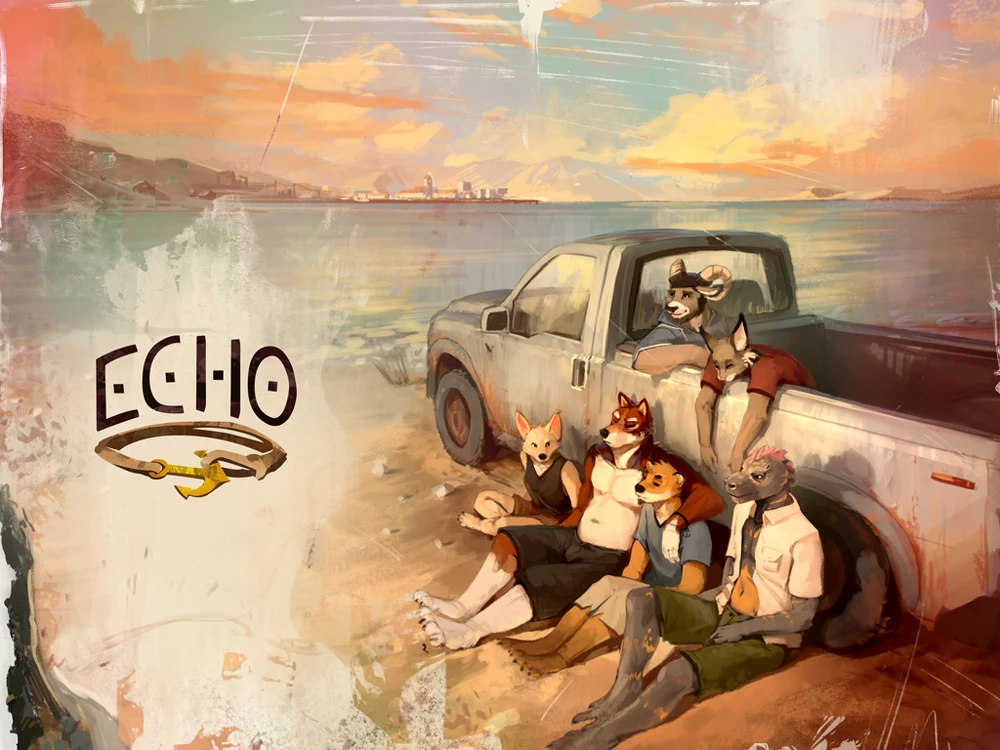

  
  
  <h1>Tradução da Visual Novel Echo para Português Brasileiro (PT-BR)</h1>

  

Este projeto tem como objetivo traduzir a visual novel **[Echo](https://echoproject.itch.io/echo)**, desenvolvida pela **[Echo Project](https://echoproject.itch.io)**, para o Português Brasileiro.

> [!IMPORTANT]
> Este repositório é um *fork* do projeto original criado por [Heruzinyo](https://github.com/Heruzinyo/EchoPTBR). Todos os créditos pela iniciativa vão para o autor original.
> 
> Nós utilizamos alguns elementos do projeto anterior (principalmente UI e fontes) e estamos focados em traduzir os conteúdos que ainda estavam pendentes, além de revisar o que já foi feito.

## 📄 Licença

Este projeto está licenciado sob a **[Creative Commons Atribuição-NãoComercial-CompartilhaIgual 4.0 Internacional (CC BY-NC-SA 4.0)](https://creativecommons.org/licenses/by-nc-sa/4.0/deed.pt-br)**.

Sinta-se livre para fazer um *fork*, clonar o repositório ou utilizar os recursos adaptados por nós (como os arquivos `.psd` ou a fonte corrigida para PT-BR) como base para seus próprios projetos, mas **lembre-se de dar os devidos créditos aos contribuidores**.

---

## ⚙️ Instalação

### 💻 PC (Windows / Linux / macOS)
1. Faça o download do **[jogo original](https://echoproject.itch.io/echo)** na **versão 1.01 (1 Year Anniversary Version)**.
2. Baixe o arquivo `.zip` contendo o Patch de tradução.
3. Extraia o conteúdo do Patch e mova todos os arquivos para dentro da pasta raiz do jogo original (substituindo os arquivos quando solicitado).

### 📱 Android
No momento, **não temos** uma portabilidade (Patch) disponível para a versão de Android.

---

## 👥 Créditos

| Função | Membros |
| :--- | :--- |
| **Tradução** | Heruzinyo, Jenna, Kaokod |
| **Revisão** | mementos |
| **Edição Gráfica & Modificações** | Heruzinyo |

---

## 🛠️ Para Desenvolvedores (Ferramentas Utilizadas)

Para a manutenção e desenvolvimento desta tradução, utilizamos as seguintes ferramentas:

* **Edição de Imagem:** [Adobe Photoshop](https://www.reddit.com/r/GenP/)
* **Edição de Vídeo:** [Adobe Premiere Pro](https://www.reddit.com/r/GenP/)
* **Edição de Texto e Código:** [Visual Studio Code](https://code.visualstudio.com)
* **Edição e Criação de Fontes:** [FontForge](https://fontforge.org/en-US/)
* **Descompilação/Compilação de APK:** [APKToolGUI](https://github.com/AndnixSH/APKToolGUI) e [uber-apk-signer](https://github.com/patrickfav/uber-apk-signer)

> **Nota:** Não é necessário descriptografar os arquivos do jogo, pois os scripts e *assets* originais não possuem criptografia impeditiva.

> **Nota²:** Os assets já estão estruturados nos níveis de diretórios necessários para os pacotes originais do jogo.